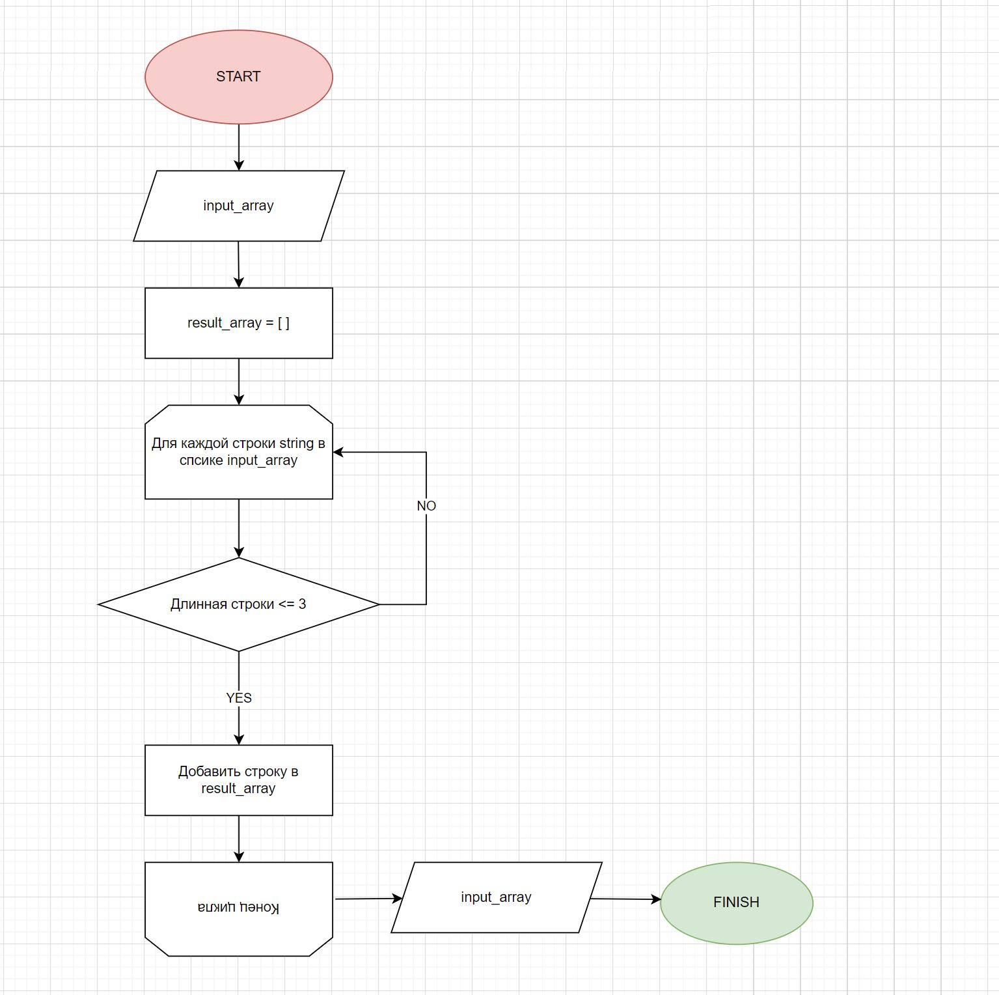

# Домашняя работа
 - Создан репозиторий на GitHub
 - Нарисована блок-схема алгоритма
 - Репозиторий оформлен текстовым описанием решения 
 - Написана программа, решающая поставленную задачу
 - Использован контроль версий в работе над этим небольшим проектом

## Задача
Написать программу, которая из имеющегося массива строк формирует новый массив из строк, длина которых меньше, либо равна 3 символам. Первоначальный массив можно ввести с клавиатуры, либо задать на старте выполнения алгоритма. При решении не рекомендуется пользоваться коллекциями, лучше обойтись исключительно массивами.

## Блок-схема

## Описание работы алгоритма filter_short_strings

Функция `filter_short_strings` предназначена для фильтрации строк из списка. Она принимает один параметр `input_array`, который является списком строк.

### Как работает функция:

1. Сначала создается пустой список `result_array`

2. Далее алгоритм перебирает каждую строку из списка `input_array` с помощью цикла, если длина строки меньше или равна 3 символам, то строка добавляется в список `result_array`.

3. По завершению цикла, когда все строки проверены, функция возвращает `result_array`

